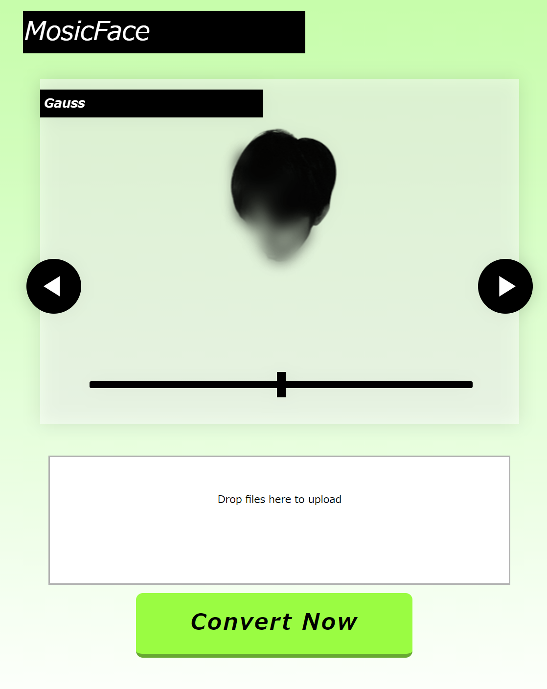
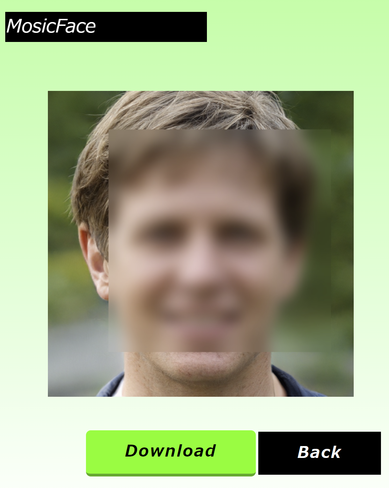
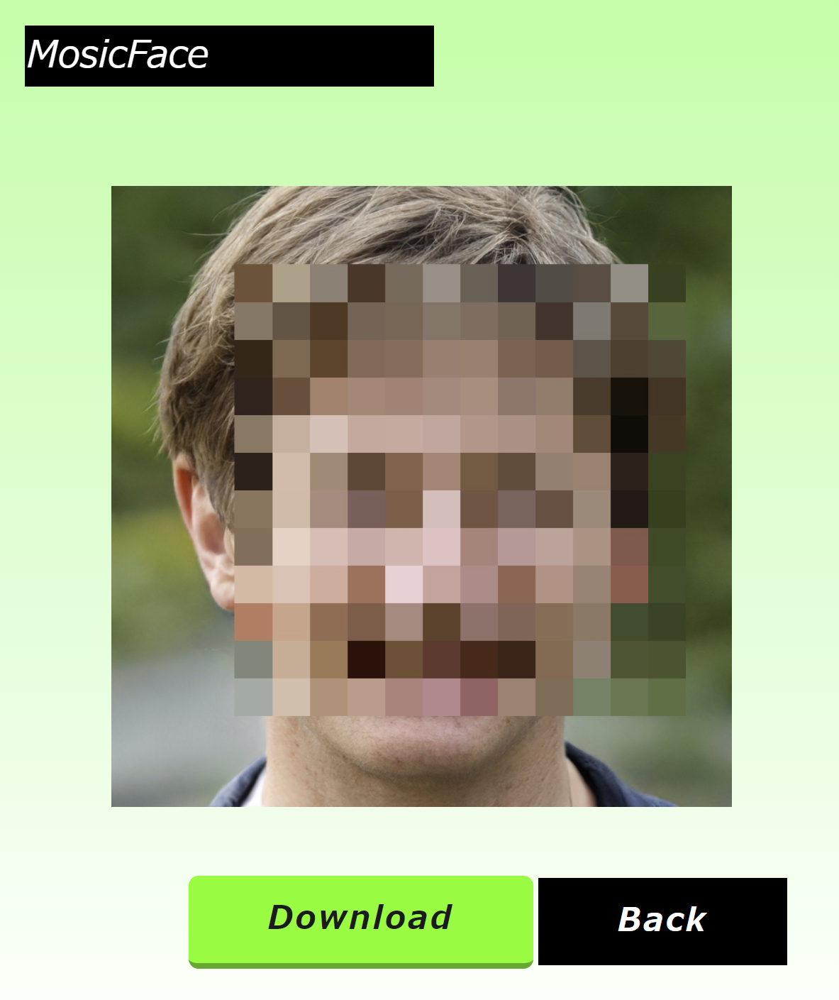
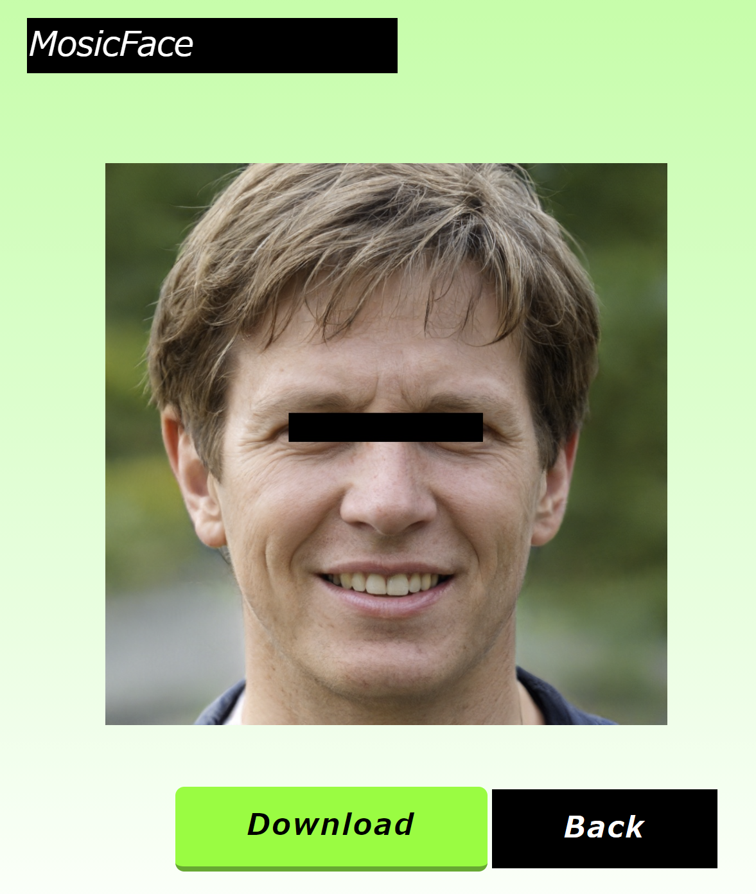

# TUS Image Project

これは学校の課題です

## Demo

|           Index           |           Gauss           |           Pixel           |           Eyes            |
| :-----------------------: | :-----------------------: | :-----------------------: | :-----------------------: |
|  |  |  |  |

## 目的

写真をアップロードし、顔認識して、顔の部分を自動的にモザイクにしてもらうウェブアプリケーション
## Framework

- [Python 3.8.6](https://www.python.org/downloads/release/python-386/)
- [Flask](https://flask.palletsprojects.com/)
- OpenCV

<center>

</center>

データベースレイヤーがない、プレゼンテーションレイヤーとビジネスレイヤーしかない。大筋はリクエストをPython関数に渡し、Python関数の中に処理する、処理した結果を返す。

## Usage

```sh
# clone the repository
git clone https://github.com/huhudev-git/tus-image-project
cd tus-image-project

# create virtual environment
python -m venv venv

# linux
source venv/bin/activate
# win
source venv/Scripts/activate

# install denpandencies
pip install -r requirements.txt
```

実行する

```sh
# linux
export FLASK_APP=pixelate
# windows
set FLASK_APP=pixelate

flask run
```


## 作業のながれ

```sh
git clone https://github.com/huhudev-git/tus-image-project.git
cd tus-image-project

# change branch
git checkout -b feature/<自分で名前をつける>
```

ファイルを修正した後

```sh
git add .
git commit -m "自分のメッセージ"
git push -u origin feature/<自分で名前をつける>
```

そしてPull Requestsを作ってください。`feature/<自分で名前をつける>`というbranchで何回commitもできるので、Pull Requestsを作ったでも、修正はまだ追加できる。

> 参考：[プルリクエストの作成方法](https://docs.github.com/ja/free-pro-team@latest/github/collaborating-with-issues-and-pull-requests/creating-a-pull-request)

Pull Requestsを完成したあと、右側でReviewersをクリック、ほかの人にコードのレビューしてもらう。すべてレビューする人はOKだったら、main branchにmergeする

```sh
# 今の作業をセーブ
git add . 
git commit -m "save"

git checkout main
git pull
git checkout <自分作業のbranch>
git merge main
```

衝突があるかもしれません、そのときはmain branchに従うまたは自分で修正します

## Path

### `/`

- Method: GET
- Params: None
- Content-Type: text/html
- Return: html(ウェブページ)

詳細

- アップロード
- モザイクのスタイルの選択
- モザイクのパターンの選択
- preview機能

### `/upload-image`

- Method: POST
- Params: 以下参照
- Content-Type: multipart/form-data
- Return: bytes(processed image)

処理流れ

- 写真を取得する
  - データサイズ制限
  - サイズ制限
- モザイクのパラメータを取得する
- 画像に顔認識する
- モザイクのパラメータによって写真を処理する
- 処理した写真を返す

#### リクエスト

| name         | type   | description                    |
| :----------- | :----- | :----------------------------- |
| mosaic_type  | string | リクエストのモザイクのパターン |
| mosaic_style | json   | リクエストのモザイクのスタイル |
| image        | blob   | 画像の内容                     |

#### レスポンス

| name  | type | description |
| :---- | :--- | :---------- |
| image | blob | 画像の内容  |

#### 参考

> [Blob](https://developer.mozilla.org/ja/docs/Web/API/Blob)

## 画面仕様

|               `/`               |        `/`(after upload)        |               全体               |
| :-----------------------------: | :-----------------------------: | :------------------------------: |
|  |  |  |

> デザインイメージ

## 機能

### 顔認識

- OpenCV
  - Viola & Johns 顔検出器

返すもの `List[Position]`

> - [Blur and anonymize faces with OpenCV and Python](https://www.pyimagesearch.com/2018/02/26/face-detection-with-opencv-and-deep-learning/)
> - [Face detection with OpenCV and deep learning](https://www.pyimagesearch.com/2020/04/06/blur-and-anonymize-faces-with-opencv-and-python/)

`pixelate/face_detect/main.py`

```py
def face_detect(image: Image) -> List[Position]:
    pass
```

### モザイクをつける

一つのスタイル/パターンで、一つのクラスで実装する

- 目に黒い線をひく
- モザイクパターン
  - ガウス
  - ピクセル
- 使うもの
  - OpenCV

#### クラスデザイン


```py
class AbstractMosaicFilter(abc.ABC):

    # フロントエンドのほうのモザイクパターンの名前
    name = None

    @abc.abstractmethod
    def process(self, image: Image, style: AbstructMosaicStyle, positions: List[Position]) -> bytes:
        '''写真を処理し、モザイクをつけた写真を返す

        Args:
            image (bytes): アップロードした写真
            style (Any): モザイクのスタイル
            positions (List[Position]): 顔認識の位置

        Returns:
            bytes: モザイクをつけた写真
        '''
        pass

class EyesLineMosaicFilter(AbstractMosaicFilter):
  """
  目に黒い線をひく
  """
  pass

class BlurMosaicFilter(AbstractMosaicFilter):
  pass

class GaussBlurMosaicFilter(BlurMosaicFilter):
  """
  モザイクパターン - ガウス
  """
  pass

class PixelBlurMosaicFilter(BlurMosaicFilter):
  """
  モザイクパターン - ピクセル
  """
  pass
```
